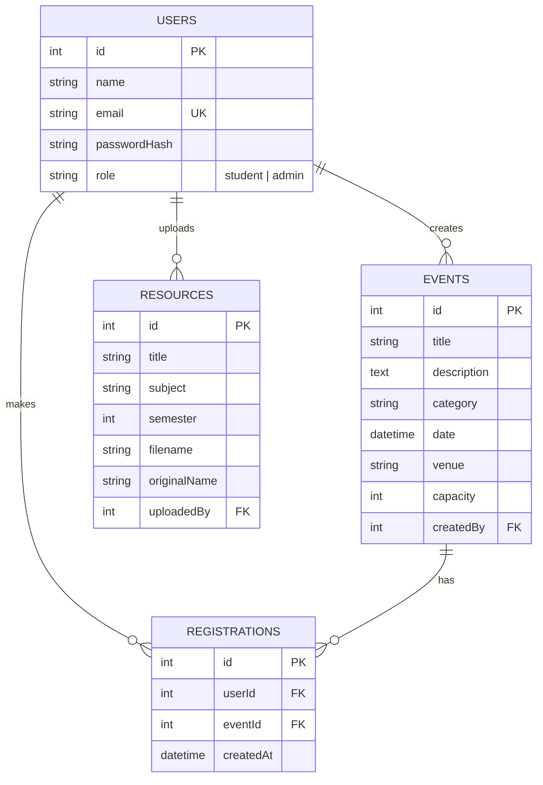

# CampusConnect - Student Event & Resource Management Portal

**Developed by: Radha Pandey, B.Tech CSE (3rd Year)**
Course: Full Stack Development Lab (BTCS303T)

Students browse and register for events (workshops, hackathons, placement drives) and download shared resources
(notes, previous-year papers). Admins create/manage events, upload resources and see analytics.

## Tech stack
| Layer | Choice |
|---|---|
| Frontend | React 18 (Vite), React Router 6, Axios |
| Backend | Node.js + Express |
| Database | Sequelize ORM: **SQLite** locally (zero setup) / **PostgreSQL** in production (set `DATABASE_URL`) |
| Auth | JWT + bcrypt (bcryptjs) |
| Tests | Jest + Supertest |
| CI | GitHub Actions |

## Features
- **Roles:** Student (signup/login, browse + register/unregister, seat availability, download resources, history) and Admin (event CRUD, upload resources, registered-student list, analytics).
- **Auth:** JWT login/signup, hashed passwords, role-based access control middleware (`authorize('admin')`), login rate limiting (5 failed attempts/min -> 429).
- **Events:** search by name, filter by date/category, seat availability, race-safe registration (transaction + row lock + unique constraint).
- **Resources:** PDF/DOCX upload (max 10 MB), filter by subject/semester, authenticated download.
- **Dashboards:** student (my events, history, latest resources) and admin (total events, registrations, students, resources, popular events).
- **Non-functional:** responsive UI, client + server validation, proper HTTP status codes, pagination (10 per page).

## Setup (VS Code)
Prerequisites: Node.js 18+.

```bash
# 1) Backend
cd backend
npm install
cp .env.example .env        # Windows: copy .env.example .env
npm run seed                # admin + demo student + 14 sample events
npm run dev                 # http://localhost:5000

# 2) Frontend (new terminal)
cd frontend
npm install
npm run dev                 # http://localhost:5173  (proxies /api to :5000)
```

Demo logins (created by `npm run seed`):
| Role | Email | Password |
|---|---|---|
| Admin | admin@campusconnect.com | Admin@123 |
| Student | student@campusconnect.com | Student@123 |

## ER diagram

`registrations` has a UNIQUE (userId, eventId) constraint so a student can register only once.

## API documentation
Base URL `http://localhost:5000`. Protected routes need `Authorization: Bearer <token>`.
Errors are returned as `{ "error": "message", "details": [..] }`.

| Method | Endpoint | Role | Description | Success | Errors |
|---|---|---|---|---|---|
| POST | /api/auth/signup | public | `{name,email,password}` creates a student | 201 | 400, 409 |
| POST | /api/auth/login | public | `{email,password}` returns `{token,user}` | 200 | 400, 401, 429 |
| GET | /api/auth/me | any | current user | 200 | 401 |
| GET | /api/events | any | query: `q, category, date=YYYY-MM-DD, upcoming, page, limit` | 200 | 400, 401 |
| GET | /api/events/:id | any | one event with `seatsLeft`, `isRegistered` | 200 | 401, 404 |
| POST | /api/events | admin | create event | 201 | 400, 401, 403 |
| PUT | /api/events/:id | admin | partial update | 200 | 400, 401, 403, 404 |
| DELETE | /api/events/:id | admin | delete event + registrations | 204 | 401, 403, 404 |
| POST | /api/events/:id/register | student | register for event | 201 | 400 (started), 401, 403, 404, 409 (full / duplicate) |
| DELETE | /api/events/:id/register | student | unregister | 204 | 401, 403, 404 |
| GET | /api/events/my | student | my registration history | 200 | 401, 403 |
| GET | /api/events/:id/registrations | admin | registered students | 200 | 401, 403, 404 |
| GET | /api/resources | any | query: `q, subject, semester, page, limit` | 200 | 400, 401 |
| POST | /api/resources | admin | multipart: `title, subject, semester, file` (PDF/DOCX) | 201 | 400, 401, 403, 413 |
| GET | /api/resources/:id/download | any | file download | 200 | 401, 404 |
| DELETE | /api/resources/:id | admin | delete resource | 204 | 401, 403, 404 |
| GET | /api/dashboard/student | student | my events + latest resources | 200 | 401, 403 |
| GET | /api/dashboard/admin | admin | analytics | 200 | 401, 403 |

Paginated responses: `{ data, page, limit, total, totalPages }`.

**Postman:** import `postman/RadhaPandey_CSE_CampusConnect.postman_collection.json`. Run *Login (admin)* or
*Login (student)* first; the token is stored automatically. For *Upload resource*, pick a PDF/DOCX in the `file` field.

## Tests (bonus)
```bash
cd backend && npm test
```
11 tests: 5 unit tests (validators, seat calculation, JWT middleware, RBAC middleware) and 6 integration tests
(auth, RBAC, seat limits, pagination/search, upload rules, dashboards).

## Index optimisation (bonus)
Slow query: events of one category from a date onward, sorted by date (the most common event filter).
```sql
SELECT id, title, date FROM events WHERE category = 'hackathon' AND date >= '2026-06-01' ORDER BY date LIMIT 10;
```
Run `npm run benchmark` (in `backend/`) - it seeds 100,000 rows, times the query, adds
`CREATE INDEX ... ON events (category, date)` and times it again. Result on my machine:

| | Time / query | Query plan |
|---|---|---|
| Before index | ~5.7 ms | `SCAN` + `USE TEMP B-TREE FOR ORDER BY` |
| After index | ~0.13 ms | `SEARCH ... USING INDEX (category=? AND date>?)` |

About **40x faster**. Exact numbers vary by machine. The Sequelize models in `src/db.js` already declare these indexes.

## Deployment (bonus)
- **Database:** create a free PostgreSQL DB (Supabase/Render/Neon) and copy its connection string.
- **Backend (Render/Railway):** root `backend`, build `npm install`, start `npm start`. Env vars:
  `DATABASE_URL`, `DB_SSL=true`, `JWT_SECRET`, `CLIENT_URL=<your frontend URL>`. Run `npm run seed` once.
  Note: free hosts have ephemeral disks, so uploaded files can vanish on restart (use S3/Cloudinary for production).
- **Frontend (Vercel/Netlify):** root `frontend`, build `npm run build`, output `dist`. Env var:
  `VITE_API_URL=https://<backend>/api`. Add a rewrite of all routes to `/index.html` for React Router.

## CI (bonus)
`.github/workflows/ci.yml` runs backend tests and the frontend build on every push and pull request.

## Suggested Git history (do not squash into one commit)
```bash
git init
git add .gitignore README.md && git commit -m "chore: project scaffold and README"
git add backend/package.json backend/src/config.js backend/src/db.js && git commit -m "feat(db): models and associations"
git add backend/src/routes/auth.js backend/src/middleware && git commit -m "feat(auth): JWT auth, RBAC, login rate limit"
git add backend/src/routes/events.js backend/src/utils && git commit -m "feat(events): CRUD, search, registration with seat limits"
git add backend/src/routes/resources.js && git commit -m "feat(resources): upload/download PDF and DOCX"
git add backend/src/routes/dashboard.js backend/src/app.js backend/src/server.js backend/src/seed.js && git commit -m "feat(dashboard): analytics and seed script"
git add backend/tests && git commit -m "test: unit and integration tests"
git add backend/scripts && git commit -m "perf: index benchmark (before/after)"
git add frontend && git commit -m "feat(ui): React frontend"
git add .github postman && git commit -m "ci: GitHub Actions and Postman collection"
git branch -M main && git remote add origin <your-repo-url> && git push -u origin main
```

## Demo video outline (3-5 min)
1. Architecture (React -> Express API -> Sequelize -> SQLite/PostgreSQL) and ER diagram.
2. Student flow: signup, search events, register, seats update, dashboard, download a resource.
3. Admin flow: create/edit event, view registered students, upload resource, analytics.
4. Show `npm test`, the 429 rate limit, and the index benchmark.

---
Author: **Radha Pandey, CSE**
